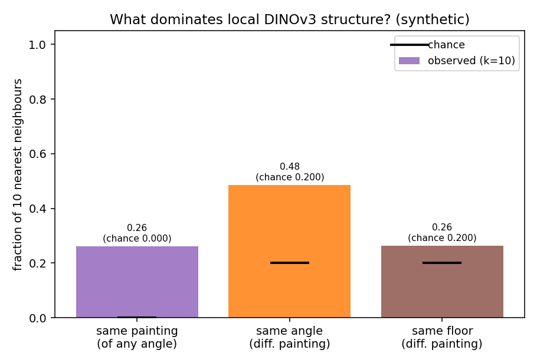
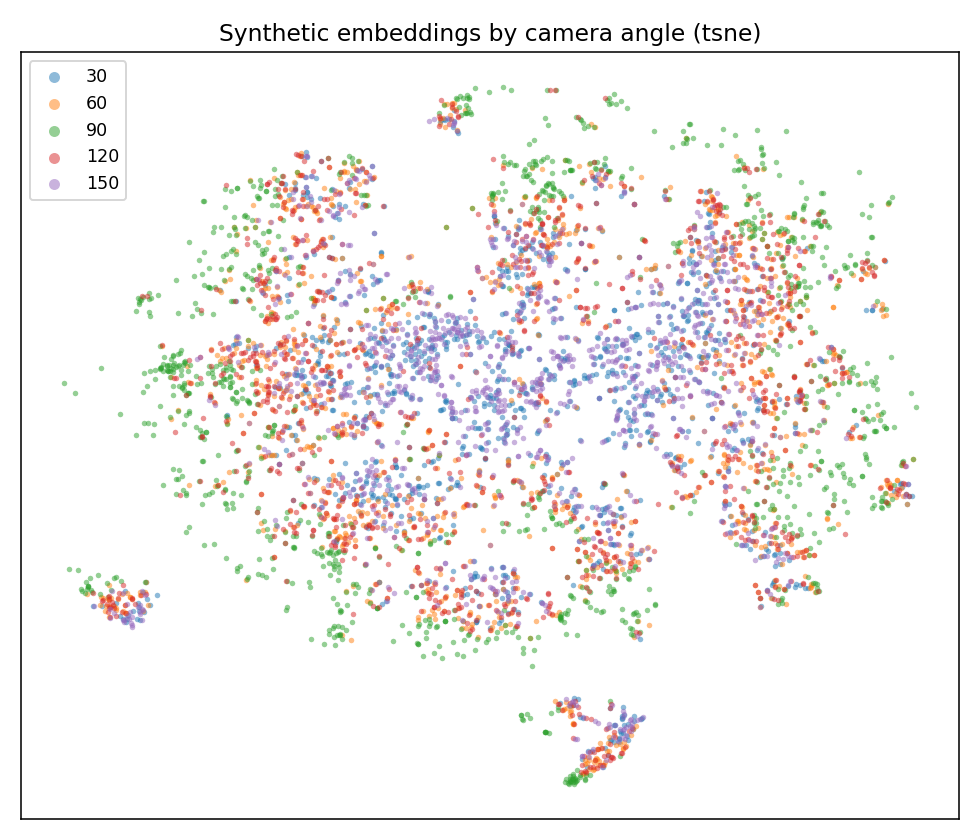
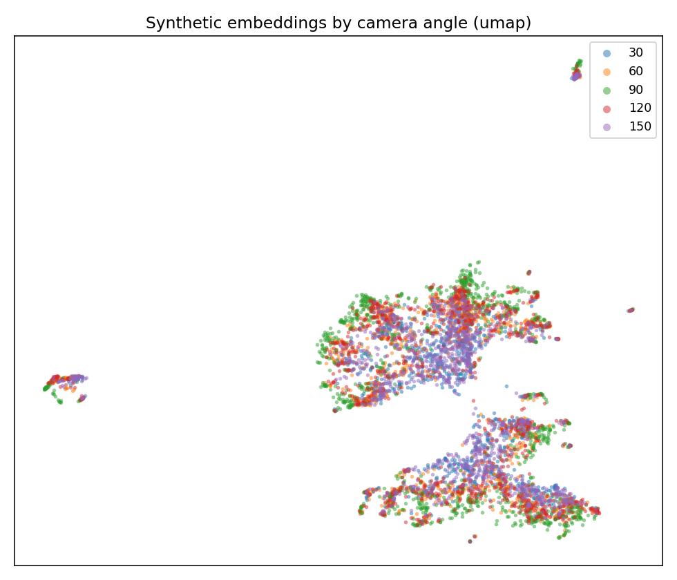
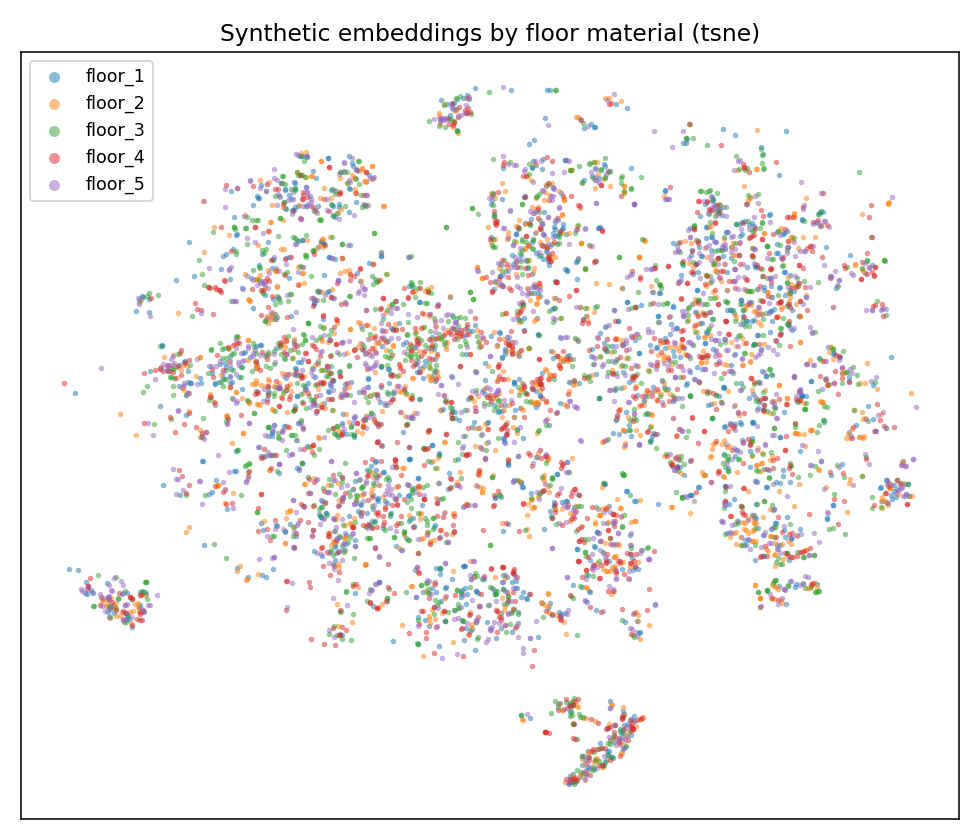
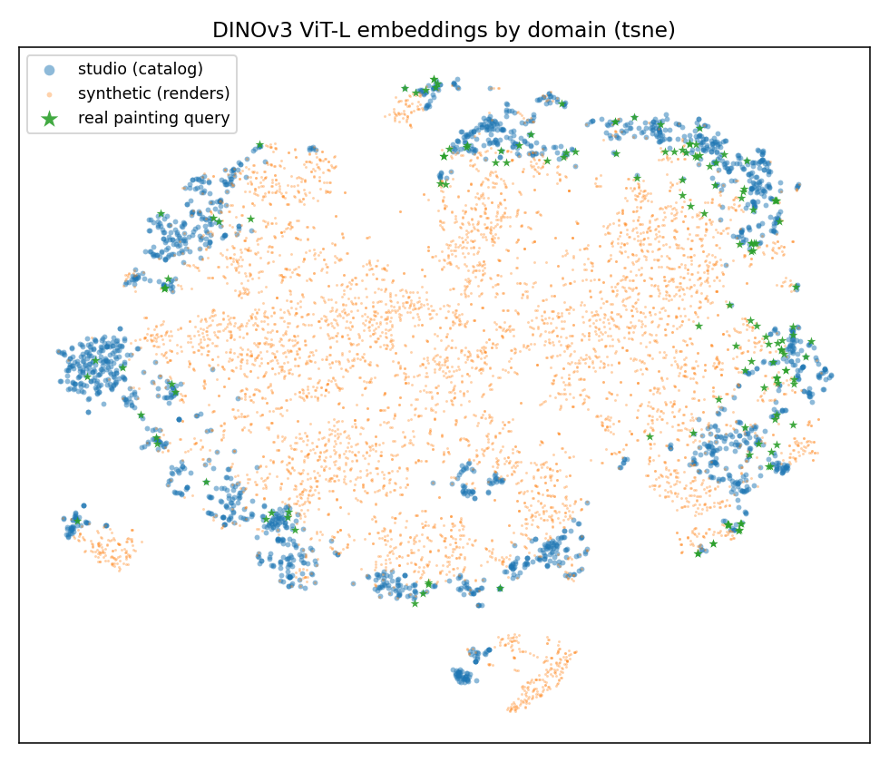
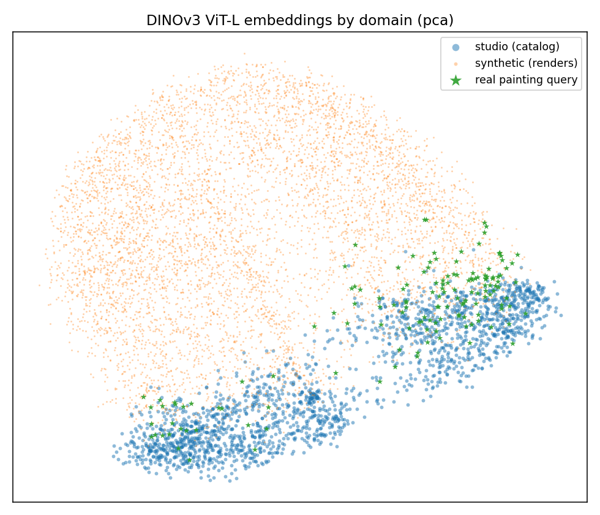
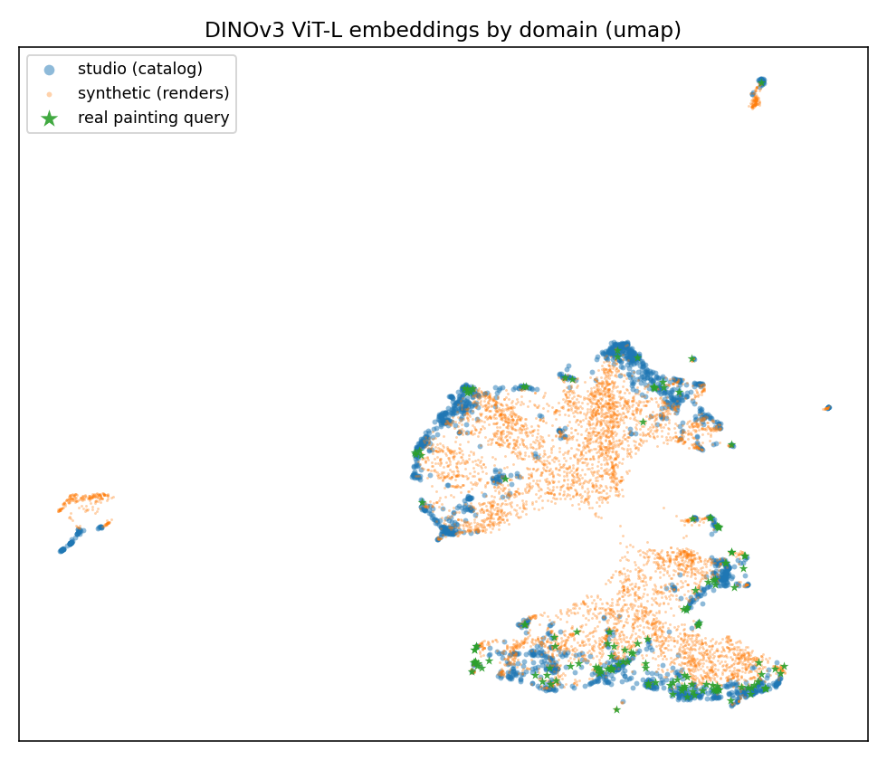
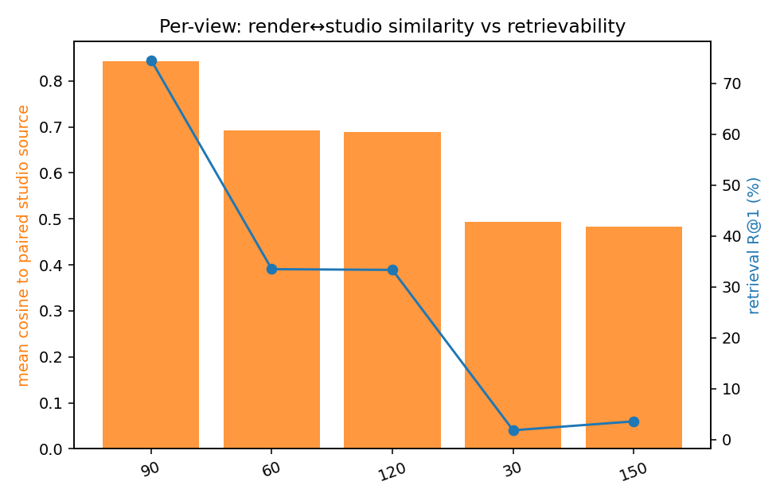

# DINOv3 embedding analysis of the v2 synthetic dataset

*v2 rerun of [`experiments/dinov3-embedding-analysis/`](../../experiments/dinov3-embedding-analysis/README.md):
push every image through the **same frozen DINOv3 ViT-L** (CLS token, aspect512 preprocessing) and ask
what makes two images land near each other — painting identity, camera angle, or the random scene
settings — and how far the renders sit from real photos. Model, preprocessing, real reference clouds,
and methodology are **identical to v1; only the renders change.** Terms (chance, enrichment,
linear-probe, silhouette, t-SNE/UMAP) are defined in the v1 doc. (Lab notebook:
[`EXPERIMENTS.md` → EXP-11](../../EXPERIMENTS.md); v1 = EXP-7.)*

Three image sets: **synthetic** = the 24,490 v2 renders (4,898 paintings × 5 arc views), **studio** =
each render's catalog source photo (`MET/<id>/0.jpg`, now exactly 4,898), **real** = the 148 committed
painting test queries. v2 also records two factors v1 couldn't test: **placard row** (z) and
**per-camera pose jitter** (y/z), parsed by [`scripts/synth_meta.py`](../../scripts/synth_meta.py).

## TL;DR

- **Identity still wins by a mile** — a render's nearest neighbours are the other views of the same
  painting ~**1,600×** more often than chance (v1: ~1,500×). The dataset redesign didn't disturb the
  property that matters.
- **The camera-angle signature weakened, as intended.** Cross-painting same-angle neighbours fell
  0.68 → **0.49** (3.4× → 2.4× chance) and kNN angle decodability 0.72 → 0.50 — the v2 pose jitter
  smears the rigid per-view structure v1 had.
- **The new factors behave like nuisances should** — floor, placard (x and z), and horizontal camera
  jitter are at or near chance. The exception: **camera height is clearly encoded** (linear probe
  0.80) — vertical perspective visibly changes the image.
- **The domain gap narrowed at the edges but didn't close.** Studio/synthetic/real are still ~99%
  linearly separable, but where in v1 *every* view sat closer to studio than to real, in v2 the
  oblique views lean (slightly) toward the real-photo side, and the frontal view now **ties the
  studio↔real distance** (0.222 vs 0.224).
- **The per-view difficulty ordering reappears** from embeddings alone — cosine-to-source falls
  0.84 → 0.69 → 0.49 along the arc, matching [EXP-10](../renders-as-queries/README.md)'s retrieval
  exactly (two methods, same conclusion, as in v1).

## 1. What makes two renders similar to the model?

Nearest-neighbour composition (k=10; angle/floor conditioned on *different-painting* neighbours to
remove the per-painting-scene confound, as in v1):



| fraction of 10 nearest neighbours that are… | v1 | **v2** | chance |
|---|--:|--:|--:|
| the **same painting** (any angle) | 0.25 | **0.26** | 0.0002 |
| (diff. painting) the **same camera angle** | 0.68 | **0.49** | 0.20 |
| (diff. painting) the same floor texture | 0.28 | **0.26** | 0.20 |

Decodability of each recorded factor from the vectors:

| factor (v2 renders) | linear probe | kNN | silhouette | chance | v1 probe |
|---|--:|--:|--:|--:|--:|
| **camera angle** (5) | **0.94** | 0.50 | −0.03 | 0.20 | *0.99* |
| floor material (5) | 0.66 | 0.50 | −0.01 | 0.21 | *0.59* |
| placard x (4 bins) | 0.56 | 0.55 | −0.01 | 0.25 | *0.55* |
| painting aspect (4 bins) | 0.74 | 0.67 | −0.01 | 0.25 | *0.73* |
| placard row z (4 bins) — *new* | 0.48 | 0.53 | −0.02 | 0.25 | — |
| camera y-jitter (4 bins) — *new* | 0.36 | 0.27 | −0.02 | 0.25 | — |
| **camera height z (4 bins)** — *new* | **0.80** | 0.46 | 0.00 | 0.25 | — |

Angle remains the strongest *secondary* pattern but is markedly softer than v1 (probe 0.99 → 0.94,
kNN 0.72 → 0.50): the jitter turned five rigid poses into overlapping pose distributions. All
silhouettes ≈ 0 — one connected cloud, no factor forms separate blobs. Camera **height** is the one
nuisance DINOv3 clearly encodes (0.80); the GN-driven randomizations (frame color, glass, light
shape, painting size) are not recorded in the metadata, so — like v1's lighting — they remain
untestable.

| coloured by camera angle (t-SNE / UMAP) | coloured by floor (t-SNE) |
|---|---|
|   |  |

## 2. How far is synthetic from real?

| can a classifier tell these apart? | v1 | **v2** |
|---|--:|--:|
| studio vs synthetic vs real (3-way) | 0.99 | 0.994 |
| studio vs synthetic | 0.99 | 0.993 |
| studio vs real photo | 0.97 | 0.972 |
| synthetic vs real photo | 0.97 | 0.973 |

| t-SNE | PCA | UMAP |
|---|---|---|
|  |  |  |

Centroid distances (1 − cosine between group means; the yardstick is the real studio→photo gap,
**0.22**):

| distance between group averages | ↔ studio | ↔ real photo |
|---|--:|--:|
| *studio ↔ real photo (the gap we care about)* | — | **0.224** |
| synthetic **90°** (frontal) | **0.143** | **0.222** |
| synthetic 60° / 120° | 0.366 / 0.371 | 0.360 / 0.364 |
| synthetic 30° / 150° | 0.550 / 0.567 | 0.508 / 0.521 |
| *v1 best (front)* | *0.15* | *0.23* |
| *v1 worst (right upper)* | *0.62* | — |

The v1 conclusion was "the renders look like clean studio shots — **no** view is closer to real
photos than the studio images already are." In v2 that has shifted: the frontal view **ties** the
studio baseline (0.222 ≈ 0.224), and every oblique view is now *closer to real than to studio* —
the extra randomization (jitter, glass, frame variety) pushes renders off the studio manifold in
the real-photo direction. They remain a clearly distinct third domain, though (0.97+ separability):
v2 narrows the gap; it does not close it.

## 3. Per-view similarity vs retrievability



| camera view | cosine to its own studio source | EXP-10 retrieval R@1 |
|---|--:|--:|
| 90° (frontal) | 0.843 | 74.52 |
| 60° | 0.692 | 33.48 |
| 120° | 0.688 | 33.34 |
| 30° | 0.494 | 1.86 |
| 150° | 0.483 | 3.61 |

Same two-method corroboration as v1 (where the broken `right upper` bottomed out at 0.44 / R@1 1.4):
the embedding distance to the source predicts the retrieval ordering exactly — but now the ordering
is the **symmetric, by-design arc fall-off**, not a rig accident. Both extreme views sit roughly at
v1's broken-view level: a ±60° grazing shot is genuinely that hard, however it arises.

## Caveats

Same as v1: frozen off-the-shelf ViT-L (not our fine-tuned models), cosine on raw CLS vectors (no
retrieval-style PCAw), 148 real photos only. v2-specific: the GN-randomized factors (frame color,
glass presence, light shape, painting size) are not in `metadata.json`, so their effect on the
embedding can't be isolated; camera y/z-jitter quartiles are *global* bins (jitter ranges overlap
the per-camera offsets only within a view, but within-angle variation is verified before decoding).

## How to reproduce

```bash
# 1) DINOv3 ViT-L vectors for the 24,490 v2 renders (GPU, ~3 min on an H100)
sbatch slurm/extract_synth_dino.slurm /mnt/storage_6/project_data/pl0896-03/visart-dataset-v2 \
    data/synth_dino_v2                                       # job 7372542
# 2) real reference vectors + analysis (CPU), with the EXP-10 R@1 overlay
sbatch slurm/analysis_synth_dino.slurm /mnt/storage_6/project_data/pl0896-03/visart-dataset-v2 \
    data/synth_dino_v2 data/descriptors/synthetic_v2/retrieval_summary.json   # job 7372543
# -> data/synth_dino_v2/analysis/{summary.json, *.png}
```

Every number above is in `data/synth_dino_v2/analysis/summary.json`; same scripts as v1
([`extract_synth_dino.py`](../../scripts/extract_synth_dino.py) ·
[`assemble_real_dino.py`](../../scripts/assemble_real_dino.py) ·
[`analyze_synth_dino.py`](../../scripts/analyze_synth_dino.py)), pointed at v2.
