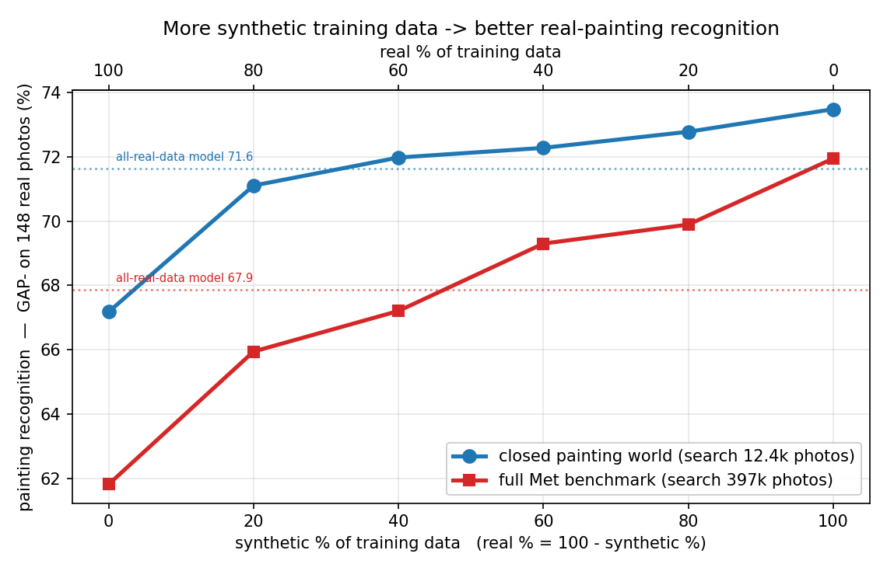
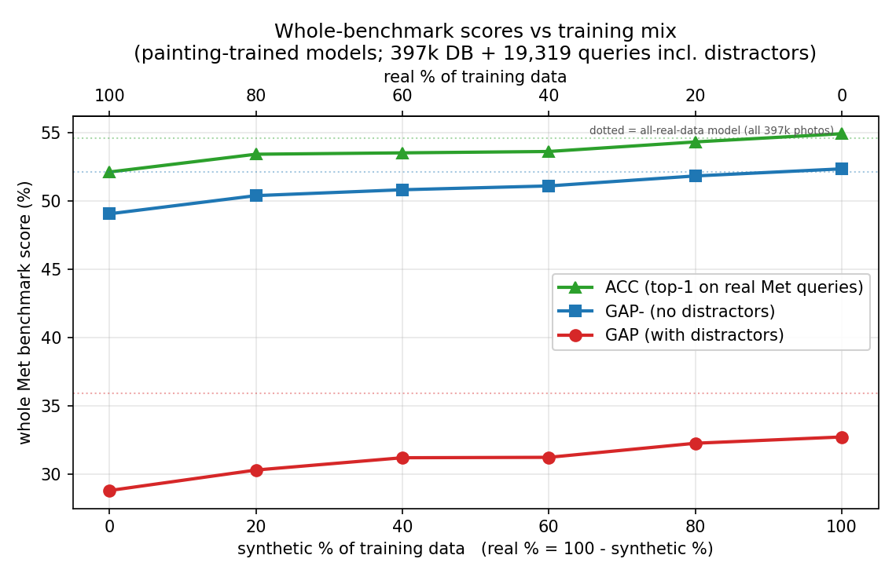
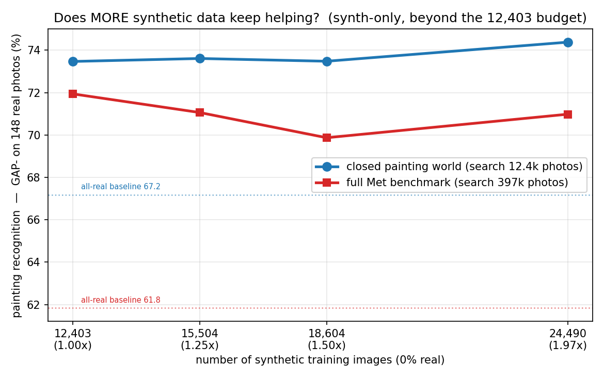

# Real vs synthetic training data, with the v2 renders

*v2 rerun of [`experiments/real-vs-synthetic-mix/`](../../experiments/real-vs-synthetic-mix/README.md):
train the painting recognizer on **real:synthetic blends at a fixed 12,403-image budget**
(100:0 → 0:100), plus the **synth-only data-scaling arm** (1× → 1.25× → 1.5× → all 24,490 renders),
and test every model on the **same real painting photos** — the easy closed painting world and the
full 397k Met benchmark. Recipe, seeds, budgets, splits, and evaluation are **identical to v1; only
the renders change** (the blend manifests reuse v1's shuffle seeds, so each v2 subset contains the
same painting/view slots, re-rendered). The 100:0 point and the all-real references contain no
synthetic data and are **reused from v1**. Protocol details, metric definitions, and the K/τ
2-fold-CV scheme are in the v1 doc. (Lab notebook: [`EXPERIMENTS.md` → EXP-12](../../EXPERIMENTS.md);
v1 = EXP-8.)*

## TL;DR

- **Every v1 conclusion survives, slightly stronger.** More synthetic still monotonically beats less;
  **synth-only (0% real) is still the best budget-matched blend** — and each v2 blend outscores its
  v1 counterpart (closed world +0.5–1.5 GAP⁻; full benchmark up to +1.4 GAP).
- **The v1 "full-benchmark plateau" is gone.** Scaling synth-only data kept v1's full-benchmark
  GAP⁻ flat (~51.9); with v2 it keeps climbing to **53.78** — and the all-renders model now **beats
  the original 397k-real-images model on the whole benchmark's non-distractor metrics**
  (GAP⁻ 53.78 vs 52.14, ACC 56.63 vs 54.64) using 24,490 synthetic painting images and **zero real
  photos**. Open-set GAP (34.38 vs 35.97) still trails — distractor rejection remains the cost of
  painting-only training.
- **In the closed world the picture is subtler:** v2 wins at every fixed-budget blend, but its
  scaling tail tops out a bit lower than v1's (74.38 vs 75.09 GAP⁻) — the v2 budget point already
  captures more of the benefit, so the extra renders add less.
- The honest-tuning audit still passes: 2-fold scores match the leaky oracle within ≤0.33 everywhere.

## Results — fixed 12,403-image budget

**Closed painting world** (148 real photos vs the 12,403-photo paint DB; K/τ by 2-fold CV):

| training mix (real:synth) | GAP⁻ v1 | **GAP⁻ v2** | ACC v1 | **ACC v2** |
|---|--:|--:|--:|--:|
| 100:0 — all real *(shared)* | 67.18 | *67.18* | 70.27 | *70.27* |
| 80:20 | 70.56 | **71.10** | 72.97 | **73.65** |
| 60:40 | 70.65 | **71.97** | 72.30 | **73.65** |
| 40:60 | 71.37 | **72.27** | 72.97 | **73.65** |
| 20:80 | 71.24 | **72.77** | 72.30 | **74.32** |
| **0:100 — all synthetic** | 72.47 | **73.47** | 73.65 | **75.00** |
| *ref: all-real-data model (397k)* | *71.62* | | *72.30* | |

**Full Met benchmark** (all 1,003 real Met queries vs the 397k DB, K/τ tuned on val; painting slice
= the same 148 photos at fixed K=7/τ=50):

| training mix | GAP v1 | **GAP v2** | GAP⁻ v1 | **GAP⁻ v2** | ACC v1 | **ACC v2** | paint GAP⁻ v1 | **paint GAP⁻ v2** |
|---|--:|--:|--:|--:|--:|--:|--:|--:|
| 100:0 *(shared)* | 28.83 | *28.83* | 49.08 | *49.08* | 52.14 | *52.14* | 61.83 | *61.83* |
| 80:20 | 30.23 | **30.33** | 50.03 | **50.41** | 52.84 | **53.44** | 66.09 | 65.95 |
| 60:40 | 31.15 | **31.23** | 50.60 | **50.84** | 53.34 | **53.54** | 67.22 | 67.21 |
| 40:60 | 30.38 | **31.26** | 50.74 | **51.12** | 53.54 | **53.64** | 67.92 | **69.30** |
| 20:80 | 30.85 | **32.29** | 50.92 | **51.85** | 53.64 | **54.34** | 69.62 | **69.89** |
| **0:100** | 31.32 | **32.75** | 51.47 | **52.37** | 54.04 | **54.94** | 70.04 | **71.94** |
| *ref: all-real model* | *35.97* | | *52.14* | | *54.64* | | *67.86* | |





v2 ≥ v1 on **every full-benchmark metric at every blend**, and the margin grows with the synthetic
fraction (GAP: +0.10 at 20% synth → +1.43 at 100%) — per image, the v2 renders are worth more as
training data than v1's, despite two of their five views being nearly unanswerable as *queries*
([EXP-10](../renders-as-queries/README.md)). The extra value plausibly comes from exactly that:
harder viewpoints, pose jitter, glass/frame variety — more invariance to learn per painting.

## Does more synthetic data keep helping? (synth-only scaling)

Same nested supersets as v1 (longer prefixes of the same shuffled pool): 12,403 (=0:100) → 15,504 →
18,604 → all 24,490.

| synth-only training images | closed GAP⁻ v1 | **v2** | full GAP v1 | **v2** | full GAP⁻ v1 | **v2** | full ACC v1 | **v2** | paint GAP⁻ (full DB) v1 | **v2** |
|---|--:|--:|--:|--:|--:|--:|--:|--:|--:|--:|
| 12,403 (1×) | 72.47 | **73.47** | 31.32 | **32.75** | 51.47 | **52.37** | 54.04 | **54.94** | 70.04 | **71.94** |
| 15,504 (1.25×) | 73.73 | 73.61 | 31.86 | **33.26** | 51.79 | **52.78** | 54.34 | **55.23** | 70.81 | **71.06** |
| 18,604 (1.5×) | 74.39 | 73.48 | 32.18 | **33.62** | 51.81 | **53.18** | 54.24 | **55.73** | 70.93 | 69.87 |
| **24,490 (≈2×, all)** | **75.09** | 74.38 | 32.68 | **34.38** | 51.94 | **53.78** | 54.34 | **56.63** | 70.90 | **70.98** |
| *all-real baseline (12,403 real)* | *67.18* | | *28.83* | | *49.08* | | *52.14* | | *61.83* | |



**Findings (scaling).**

1. **Full benchmark: the v1 plateau is gone.** v1 gained +0.5 GAP⁻ from 1× to all-renders and
   flattened at ~51.9; v2 keeps climbing (+1.4, to 53.78) with ACC up +1.7 (to 56.63). At the top,
   the painting-only, synthetic-only model **exceeds the all-real 397k-image reference** on both
   GAP⁻ (53.78 vs 52.14) and ACC (56.63 vs 54.64) — v1 never crossed that line. Distractor-inclusive
   GAP still trails the reference (34.38 vs 35.97), same reason as v1: the model never saw the other
   219k non-painting classes.
2. **Closed world: v2 starts higher, scales flatter.** v2's 1× point (73.47) already exceeds v1's
   1.25× point; from there it adds only +0.9 (74.38 at all renders) where v1 added +2.6 (75.09). The
   148-photo noise floor (~±2) cautions against reading the v1−v2 tail difference too hard; what is
   solid is that both scale arms sit far above the all-real baseline (+7 GAP⁻).
3. **The painting slice on the full DB is flat-noisy in v2** (71.94 → 70.98 across the arm, fixed
   K=7/τ=50) — its 1× value is already at the v1 arm's ceiling.

## Honest-tuning audit (closed world)

As in v1: the reported 2-fold cross-validated score vs the leaky "oracle" (tune = report on all 148).

| mix | reported (2-fold) | oracle | diff |
|---|--:|--:|--:|
| 80:20 | 71.10 | 71.37 | +0.27 |
| 60:40 | 71.97 | 71.95 | −0.02 |
| 40:60 | 72.27 | 72.21 | −0.06 |
| 20:80 | 72.77 | 72.91 | +0.14 |
| 0:100 | 73.47 | 73.68 | +0.21 |
| synth125 / synth150 / synthall | 73.61 / 73.48 / 74.38 | 73.70 / 73.81 / 74.51 | +0.09 / +0.33 / +0.13 |

All ≤ 0.33 — the K/τ choice is not what produces the v2 gains. (Per-fold picks spread over
K ∈ {2…50}, τ ∈ {30, 50, 100}; as in v1, τ barely moves the score.)

## Caveats

Unchanged from v1: 148 test photos (single-pair differences ≤ ~2 points are noise — trust the
monotone trend and the all-real → all-synthetic jump), closed-world numbers not comparable to the
paper's GAP 36.1, painting-only models can't reject the 18k distractors. v2-specific: the v1↔v2
*scaling-tail* comparison in the closed world (74.4 vs 75.1) is within the noise floor; the
full-benchmark v2 > v1 pattern (9 of 9 blends × metrics, growing with synth fraction) is the robust
result.

## How to reproduce

```bash
.venv/bin/python scripts/build_paintings_mix_data.py \
    --syn /mnt/storage_6/project_data/pl0896-03/visart-dataset-v2 --suffix _v2   # manifests (job 7372438)
for tag in 80r20s 60r40s 40r60s 20r80s 0r100s; do                 # blends (100:0 = v1, reused)
  t=$(sbatch --parsable --job-name=met-tr-$tag-v2 slurm/paint_train.slurm data/gt_paint_mix_${tag}_v2 data/aug_v2 paint_${tag}_v2)
  sbatch --dependency=afterok:$t --job-name=met-ev-$tag-v2   slurm/paint_eval.slurm data/models/r18SWSL_paint_${tag}_v2 10 ${tag}_v2
  sbatch --dependency=afterok:$t --job-name=met-full-$tag-v2 slurm/eval_full.slurm  data/models/r18SWSL_paint_${tag}_v2 10 ${tag}_v2
done
for tag in synth125 synth150 synthall; do                         # scaling arm (same pattern)
  t=$(sbatch --parsable --job-name=met-tr-$tag-v2 slurm/paint_train.slurm data/gt_paint_${tag}_v2 data/aug_v2 paint_${tag}_v2)
  sbatch --dependency=afterok:$t --job-name=met-ev-$tag-v2   slurm/paint_eval.slurm data/models/r18SWSL_paint_${tag}_v2 10 ${tag}_v2
  sbatch --dependency=afterok:$t --job-name=met-full-$tag-v2 slurm/eval_full.slurm  data/models/r18SWSL_paint_${tag}_v2 10 ${tag}_v2
done
.venv-dino/bin/python scripts/plot_mixing_report.py --v2          # the three figures
```

Trainings: jobs 7372513–7372534 (~24–60 min each on an H100); closed evals 7372514–7372535; full
evals 7372515–7372536. The painting slice comes from each full-eval log's `PAINT148` line (same
K=7/τ=50 protocol as v1's batch re-score).
